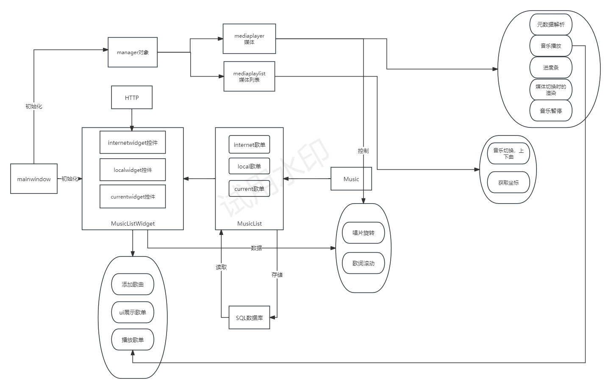

# Music

## 设计思路

1. 整体ui设计
   
   1. 导入模块：导入本地音乐以及在线网络资源
   
   2. 播放模块：实现音乐资源播放，暂停
   
   3. 歌词模块：显示歌词
   
   4. 唱片模块：显示图片并旋转
   
   5. 进度条模块：显示播放进度
   
   6. 浏览模块：显示本地音乐资源以及可访问网络资源

2. 功能设计流程
   
   1. 音乐播放
      
      > playerManager管理音乐添加和播放
   
   2. 获取音乐的图片并显示
   
   3. 界面控件功能实现
      
      > 1. 进度条silder拖拽相关信息个更新
      >    
      >    1. 这里为其鼠标点击事件添加音频暂停，优化体验（x）
      > 
      > 2. 歌曲内容line内容获取
      > 
      > 3. 播放暂停按钮button
      > 
      > 4. 切换歌曲button
      > 
      > 5. 调节声音button
   
   4. 歌单类musiclist和music类设计
   
   5. 自定义控件KxMusicListWidget：用来管理MusicList（歌单）
      
      > 测试当前程序完成度: 成功
      > 
      > 1. 定义歌单local
      > 
      > 2. 添加本地音乐到local
      > 
      > 3. Musiclistwidget控件显示
      > 
      > 4. 控件对象存入musicmanager进行音乐播放
   
   6. 本地文件导入模块
      
      > 设置槽函数on_addButtonClicked: 打开文件对话窗，添加到本地歌单
   
   7. 获取网络资源.json
      
      > 1. 设计请求，响应类
      > 2. 槽函数读取json文件
   
   8. json文件解析
      
      > 通过可调用API直接从QJson文件获取
      > 根据获取信息生成对应图片，MP3，歌词的url
      > 获取对应图片，MP3，url数据
   
   9. 获取音乐相关数据
      
      > 根据解析json获取信息生成对应图片，MP3，歌词的url
      > 获取对应图片，MP3，url数据（x）
   
   10. 播放音乐
       
       > 媒体流播放方式，可以便获取边播放：用mediaplayer接受MP3url
   
   11. 歌单设计
       
       > 在mainwindow类下初始化三个歌单：cerrent, local, internet
   
   12. 唱片设计
       
       > 将一个label部件设置图案，并将图案剪切为圆形自适应部件
       > 设置定时器，根据一定频率出发绘画操作
       > 自定义绘画事件函数，系统自动调用，绘制图案并以中心点不断旋转
       > 与mediaplayer绑定，播放就设置旋转，暂停就停止
   
   13. 滚动歌词
       
       > 歌词文件处理：根据\r\n为分界，将文件分割存放在QMap<int, QString>内作为歌词集合
       > ui设计：在widget内垂直布局6个label显示歌词
       > 滚动设计：
       > 
       > - 绑定media的postionchanged事件，随歌曲播放时间进行歌词位置变换
       > 
       > - 根据postion与歌单集合的key进行比较，得到最接近位置一行歌词作为currentline
       > 
       > - 存储current前三个后两个line，组成当前显示歌词集合
       > 
       > - 传出集合，label渲染

3. 逻辑模块设计
   
   1. mianwindow类：主窗口
   
   2. musicList类：音乐列表
   
   3. music类：音乐类
   
   4. musiclistwidget类：歌单管理
   
   5. http类，请求，处理，返回数据
   
   6. rotatable类，唱片旋转
   
   7. lyrics：歌词处理

## 遇到问题与解决方案

1. current歌单处理复杂，容易出错
   
   > 注意要和media处理好逻辑，当媒体发生变化要一起变化
   > 注意当local，current传入媒体时，current作为当前播放歌单要将歌曲加入存在

2. 在总体设计上，媒体的相关信息依靠元数据解析获取，而不是从music内获取，导致在线音乐播放出现问题，在线播放音乐因为是流媒体，无法实时解析元数据
   
   > 为媒体设计集合存储当前播放歌曲，这个集合要注意适时加入music不能缺漏
   > 再根据playlist的index访问集合

3. 歌单显示重复
   
   > 每一次歌单显示之前，要先clear之前的内容

4. 接受json应答处理，占用了finished信号，其他请求无法保证connect连接，比如说现在获取MP3文件，都是一个信号会冲突
   
   > 设置多组对象来接受不同的数据，并设置请求队列避免同类型数据之间竞争

## 不足

1. http数据获取没有实现完，目前只能获取到json，解析后获取对应mp3数据，img和歌词还未获取，后面的歌词滚动因为还未获取歌词数据，现在播放的还是本地歌词来展示功能

2. 界面优化不足，因为ui里面嵌套多级，还有stackwieget的同级界面，很多样式还未完成，唱片和歌词还可以设计的更美观，目前比较简陋

3. 本地音乐无法和线上音乐很好耦合，设计本地音乐的功能线上音乐无法使用，比如元数据解析展示，线上音乐要独立开处理，Music类内，线上音乐需要记录更多信息，并且需要相关实现，说明在设计上不够完美，不能找到一个合适的解决方案，导致代码冗长复杂

## 结构图

