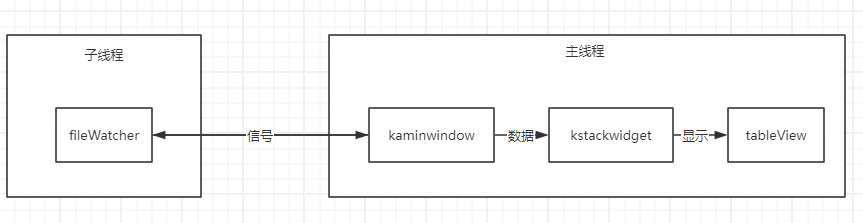
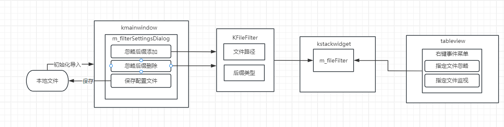
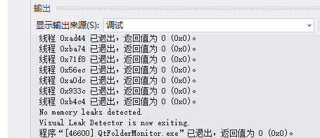
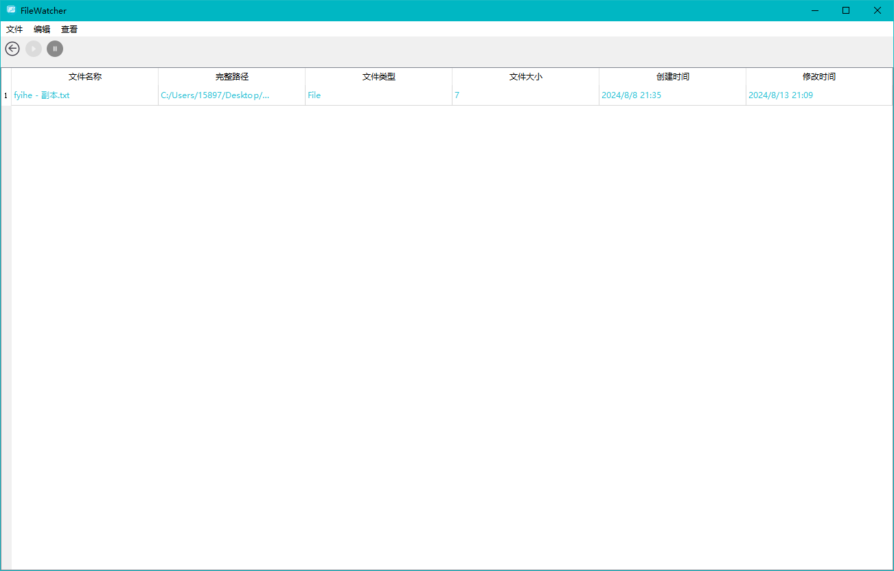

> # FileWatcher

> ## 一. 总体介绍
> 
> *文件监听工具，可以监听本地文件操作(创建、删除、修改、重命名、移动等不限于此)产生的系统消息，可用于辅助开发决策和问题排查*
> 
> ## 二. 设计思路
> 
> 1. **主要类说明**
>    
>    > 1. KMainwindows: 主窗口界面
>    > 
>    > 2. FileWatcher：监控类，监控路径文件变动，返回相应数据
>    > 
>    > 3. KStackWidget: 界面容器，存储了主要的展示内容：监控文件，监控日志，日志信息
>    > 
>    > 4. FileFilter: 存储配置信息
>    > 
>    > 5. KFileDialog: 设置忽略后缀的对话框
> 
> 2. **主要监控逻辑**
> 
> 1. fileWatcher设计：
>    
>    > * 采用pimple模式，分为kFileWatcherEngine（公共接口类）KFileWatcherPrivate(私有实现类)方式隐藏实现细节
>    > 
>    > * win32API: 处理文件监控，通过给与dir即可监控目录
>    > 
>    > * 缓冲区处理：获取文件监控结果action
>    > 
>    > * fileInfo: 获取文件信息
>    > 
>    > * 返回函数：用于主线程安全调用时获取数据
>    > 
>    > * 信号：提示主线程文件变化
> 
> 2. kmainwindow设计
>    
>    > * thread: 将filewatcher实例movetothread子线程
>    > 
>    > * 槽函数：接收信号，采用invokeMethod安全通信，调用子线程实例内部返回函数获取数据
>    > 
>    > * 传输：将数据（action，fileinfo）传给stackwidget
>    > 
>    > * 信号：提示子线程目录变更，监听停止，监听恢复，也采用安全通信方式
>    > 
>    > * timer：延迟接收信号，避免高频率信号影响stackwidget
> 
> 3. stackWidget
>    
>    > * actionData: 文件变更行为列表
>    > 
>    > * fileInfoData:文件信息列表
> 
> 4. tableView
>    
>    > * tableview(文件监视)：根据filedata生成一个模拟文件资源管理器的界面，并可直观查看哪些文件发生变化
>    > 
>    > * easytableview(目录监视)：根据actiondata生成一个目录监视，可查看变更文件的更改次数
>    > 
>    > * logtableview(目录信息)：直接展示actiondata
> 
> 3. **详细设计**
>    
>    1. 监听的暂停、恢复：button发送信号，子线程关闭句柄/启动句柄并监控
>    
>    2. 用户配置：
>       
>       > * 处理忽略后缀：在kmainwindow的对话框内设置忽略列表，传给kstackwidget的m_fileFilter
>       > 
>       > * 指定文件忽略/监控：右键获取对应行的文件路径信息，记录入m_fileFilter
>       > 
>       > * Model更新：更新时根据m_fileFilter忽略掉不需要的actiondata项
>       
>       
>    
>    3. 多目录监控：创建新的mainwindow实例处理新的目录路径
>       
>       > 缺点: 无法单个窗口查看所有，用户视觉体验不好 优点:
>       > 
>       > 1. 避免多个子线程和主线程相互之间的竞争。
>       > 
>       > 2. 独立的逻辑基于qt框架，异步且稳定性好，也能提升单个监控性能。
>       > 
>       > 3. 避免了监控信息混杂在一起，更加清晰
>    
>    4. 用户操作日志：
>       
>       > * kmainwindow包含了所有界面控件的接口，每次触发前向m_userLogs存入一条日志
>       > 
>       > * 对话框显示日志
>       > 
>       > * 保存日志至本地
>    
>    5. 关键字搜索，排序：model自带API提供排序，关键词搜索
>    
>    6. 系统托盘（消息通知）
>       
>       > * 设置系统托盘m_trayIcon
>       > 
>       > * 重写closeevent事件隐藏窗口实现最小化托盘
>       > 
>       > * timer控制图片切换实现系统托盘闪烁
>       > 
>       > * 最小化时接收子线程消息开始闪烁，点击后取消闪烁
> 
> ## 三. 问题与解决
> 
> 1. 在kfilewatcher里使用window自带的线程导致问题
>    
>    > windowAPI下的线程本身是与QT框架下的实现不一样的，导致信号与槽无法使用，传输出问题KFileWatcher继承QObject，对应实例在kmainwindow里通过movetothread来处理
> 
> 2. 线程间的安全通信invokeMethod无法找到在执行函数
>    
>    > 为调用函数添加Q_INVOKABLE宏声明函数线程安全调用
> 
> 3. 线程间的安全通信invokeMethod加入事件队列失败
>    
>    > 因为子线程传参且很复杂，所以使用Qt::DirectConnection连接方式
> 
> 4. 监控文件更改快速的路径页面渲染出问题
>    
>    > * 文件更改很频繁，当向主线程发送信号,主线程还未完成处理信号的逻辑，新的信号发送刷新了信号处理逻辑
>    > 
>    > * 将处理逻辑加上互斥锁，避免处理时干扰。但是即使不处理信号，信号一直发送也会导致处理逻辑无法得到主线程时间
>    > 
>    > * 定时器延时接收，设置最快频率，假设当信号频率高于500毫秒，我们认为主线程无法处理完逻辑，所以一直等待，直到信号频率下降，集中处理积累信号（这个方法并不好，仅仅是这种方法）
>    > 
>    > * 其他方案思考：为数据设置共享区，主线程定期去取数据更新，不确定是否会因为频繁的改动，共享区一直被子线程占用，之前尝试互斥锁遇到类似问题（主线程对子线程的方法调用事件一直无法得到响应）
>    > 
>    > * 总结：程序架构设计臃肿，在数据传输方面十分笨拙
> 
> ## 四. 优化
> 
> 1. 内存泄露
>    
>    > * m_timer的释放，先停止，再释放
>    > 
>    > * m_thread的释放
>    >   
>    >   * 首先先释放实例对象m_watcher，析构函数停止run函数循环
>    >   
>    >   * 等待m_thread结束，释放
> 
> *vld.h测试内存泄漏通过*
> 
> 
> 
> 2. 延时处理 ：，文件更改很频繁，子线程频繁发信号。当向主线程发送信号,主线程还未完成处理信号的逻辑，新的信号发送刷新了信号处理逻辑
>    
>    > 不立即处理子线程信号，集中处理，减少了线程间通信次数，缓解了程序界面渲染的开销
>    > 
>    > * m_timer规定时间500毫秒，结束后执行渲染逻辑
>    > 
>    > * 如果500毫秒内再次收到信号，m_timer刷新，直至可以执行逻辑
>    > 
>    > * 执行逻辑获取集中堆积的actiondata进行处理
> 
> 3. 界面优化
>    
>    > 采用stackwidget，每个显示采用一个tableview显示在一个页面
>    > 
>    > * 避免了大量组件堆积在一个界面，用户观感拥挤
>    > 
>    > * stackwidget只会渲染对应页面内容，其他页面不会渲染，提高性能
> 
> 4. 采用pimple设计模式
>    
>    > 将文件监控类分为：kFileWatcherEngine（公共接口类）KFileWatcherPrivate(私有实现类)内部实现全部隐藏。engine只负责提供接口
> 
> 5. 获取路径下所有文件信息耗时十分长
>    
>    > 因为采用递归地方式访问目录，所以导致事件很长采用QT框架的API可以避免递归，节省了大量时间
> 
> 6. 模拟资源管理器
>    
>    > * 用户可以直观地像看文件资源管理器一样查看都有哪些文件，子目录下有什么文件，那些文件发生了变化
>    > 
>    > * 避免了常规的目录监听只能看到哪个文件更改了，不直观
> 
> 
> 
> 子目录下：
> 
> ## 五. 存在问题
> 
> 1. pimple设计模式反而影响了性能
>    
>    > 因为filewatcher是在子线程运行，和主线程会进行大量通信，最初设计未注意这一点，导致实际上通信很麻烦，还会牺牲一些性能，因为会多一个传递过程：private - engine - kmainwindow总结：经验不足，没在最初设计时考虑到这个部分不适合采用pimple模式
> 
> 2. 文件管理器监控设计不完善，不完美
> 
> > 不完善：高亮显示更改的文件，如果可以关联其父目录一起高亮，观感会更好
> > 
> > 不完美：文件管理器监控设计导致了严重问题
> > 
> > * 获取大量文件信息耗时长（已优化）
> > 
> > * 为了高亮显示，每次model更新数据时，要进行action和fileinfo之间的匹配当文件数量很大或是actiondata很大，匹配的工作量很大，这导致了两个严重问题
> >   
> >   * 脚本检测：信号发送频繁，actiondata很大，匹配工作造成很大主线程负担，渲染面临巨大问题（折中优化策略：延时处理，上文有说明）
> >   
> >   * c盘检测：信号发送频率快，actiondata大，file info很大，延时处理排不上用处（因为c盘的文件变更是持续的，脚本有结束的时候，c盘没有结束时间）（当前处理方式，阻止用户监控c盘）
> >     
> >     > 以上问题集中起来，基本上debuff叠满了，尝试了很多次都没有成功解决
> 
> *总结：对程序结构的设计能力不足，设计后的实现产生了很多问题，甚至无法解决*
> 
> 3. 未采用单例模式
>    
>    > 设计时计划采用单例模式来存储监控的数据，相较于线程间通信的方式应该会得到更好的性能
